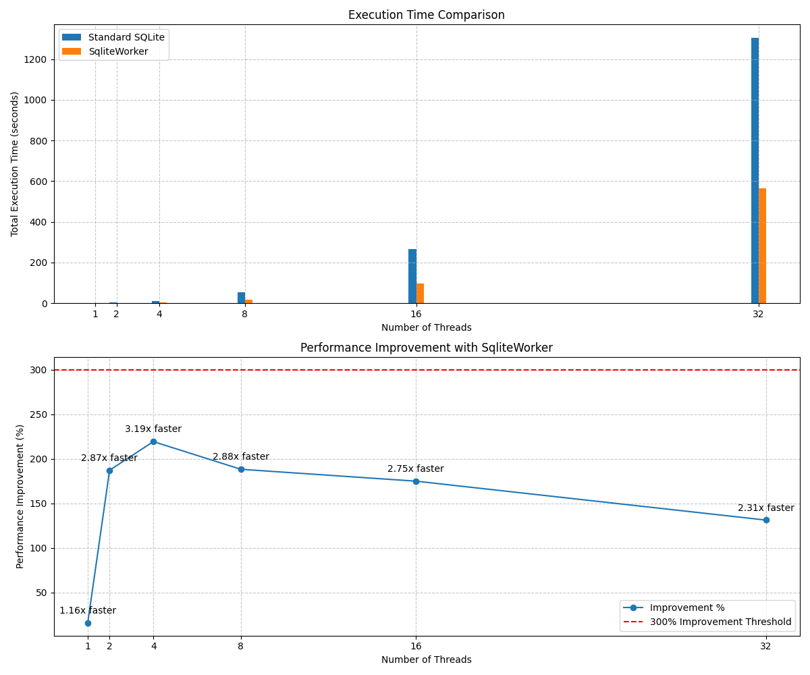

# sqlite-worker

Sqlite-Worker is a Python package providing a thread-safe interface for SQLite database operations. It ensures safe concurrent access to SQLite databases and simplifies executing database queries from different threads.

## Features

- Thread-safe SQLite database operations
- Queue-based query execution
- Simple and easy-to-use API
- Initialization actions executed once upon database connection
- Regular commits for continuous query streams

## Installation

To install, run:

```sh
pip3 install sqlite-worker
```

## Sqlite vs SqliteWorker Comparison


# Creating a Worker Instance
To create a basic instance of Sqlite3Worker by specifying the path to your SQLite database file:

```python
from sqlite_worker import SqliteWorker
worker = SqliteWorker("/path/to/your/database.db")
```

# Worker instance with Initialization Actions
Create a `SqliteWorker` instance with initialization actions (such as setting pragmas):

```python
from sqlite_worker import SqliteWorker

init_actions = [
    "PRAGMA journal_mode=WAL;",
    "PRAGMA synchronous=NORMAL;",
    "PRAGMA temp_store=MEMORY;"
]

worker = SqliteWorker("/path/to/your/database.db", execute_init=init_actions)
```

# Worker Instance with Regular Commits
Create a SqliteWorker instance with initialization actions and set a maximum query count for regular commits:

```python
from sqlite_worker import SqliteWorker

init_actions = [
    "PRAGMA journal_mode=WAL;",
    "PRAGMA synchronous=NORMAL;",
    "PRAGMA temp_store=MEMORY;"
]

worker = SqliteWorker("/path/to/your/database.db", execute_init=init_actions, max_count=50)
```


# Execute Queries

## Creating a table
```python
worker.execute("CREATE TABLE example (id INTEGER PRIMARY KEY, name TEXT)")
```

## Inserting data
```python
worker.execute("INSERT INTO example (name) VALUES (?)", ("Alice",))
```

## Fetching data
```python
token = worker.execute("SELECT * FROM example")
results = worker.fetch_results(token)
print(results)
```

# Closing the Worker
After completing all database operations, close the worker to ensure proper cleanup:
```python
worker.close()
```

# Contributing
Contributions to the Sqlite-Worker are welcome! Please refer to the project's issues and pull request sections for contributions.

# Acknowledgements

Special thanks to [Johannes Ahlmann](https://github.com/codinguncut) for their valuable suggestion on initializing actions and implementing regular commits.
